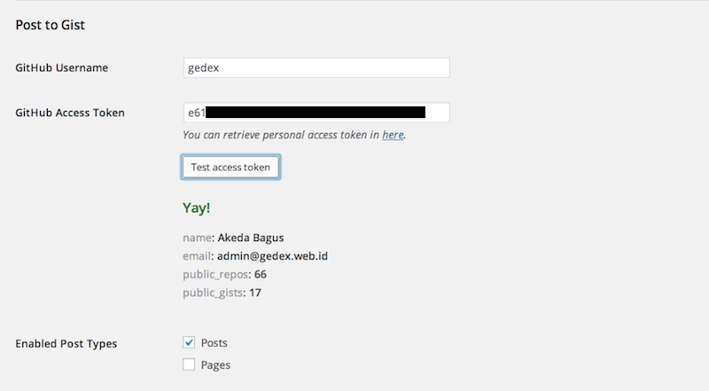

<!-- DO NOT EDIT THIS FILE; it is auto-generated from readme.txt -->
# Post to Gist

Post to GitHub Gist every time a post is saved.

**Contributors:** [akeda](http://profiles.wordpress.org/akeda)  
**Tags:** [gist](http://wordpress.org/plugins/tags/gist), [post](http://wordpress.org/plugins/tags/post), [github](http://wordpress.org/plugins/tags/github)  
**Requires at least:** 3.6  
**Tested up to:** 3.8  
**Stable tag:** trunk (master)  
**License:** [GPLv2 or later](http://www.gnu.org/licenses/gpl-2.0.html)  

## Description ##

This plugin provides the ability to save post into [GitHub Gist](https://gist.github.com) every time a post is saved.

**Features**

* Choose which post type is enabled.
* Saves post content as text file and post object (as JSON).
* Updates post also updates the Gist (creating Gist revision).
* Meta box which shows Gist associated with the post.
* Gist publicity follows post status.

**Development of this plugin is done [on GitHub](https://github.com/gedex/wp-post-to-gist). Pull requests welcome.**

## Installation ##

1. Upload Post to Gist plugin to your blog's `wp-content/plugins/` directory and activate.
2. Go to writing settings, `/wp-admin/options-writing.php` and fill your GitHub username and access token.
   You can get personal access token in [here](https://github.com/settings/tokens/new). There's a test button
   to verify your access token.

## Screenshots ##

### Setting page, under Writings section, to set GitHub username and access token. Choose which post types are enabled for Post to Gist. There's test access token feature to make sure provided access token is valid.

### Meta box where no Gist associated with the post yet.

### Meta box where there's a Gist associated with the post.

### Saved Gist.

## Changelog ##

### 0.1.0 ###
Initial release

